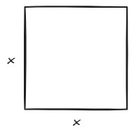

## Other bases
From tutorial,

3.(b)

$$\frac{1011_{2}}{3210} = 1 \cdot 2^3 + 1 \cdot 2^1 + 1 \cdot 2^0 = 8 + 2 + 1 = 11$$

(l)  Base 3

$$1201_{3} = \frac{1201}{3210} = 1 \cdot 3^3 + 2 \cdot 3^2 + 1 \cdot 3^0$$

$$= 27 + 18 + 1$$

$$= 46$$

4.(h)

$$3 \times 9^9 + 4 \times 9^6 + 4 \times 9^4 +8 \times 9^2 + 7$$

Write that as Base 9.

The biggest exponent is 9, so write the entire thing out:

$$987654321$$

$$=\frac{3004040807_{9}}{987654321}$$

## Chapter 2. Algebra
Second note on Canvas.

We'll use variables like $x$ and $y$. We will compute using variables.

Variables are great and useful. Let's say, for example, you are given a square:

You may not want to specify the length of the side $x$. Thus,

$$\text{Area} = x \cdot x = x^2$$

This has a lot of advantages. For example, say you are given the area as $9$. You might want to learn the length of the square's side.

Then:

$$\text{Area} = x^2 = 9$$

How do you express $9$ as something in the same form as $x^2$?

Write $9 = 3 \cdot 3 = 3^2$

$$x^2 = 3^2$$

$$x = 3$$

We just solved a simple equation for $x$. That's what we'll do for a while. We'll learn about the quadratic equation later.

By the way, variables can be any letter. Usually $x$ or $y$.

But first, there is a question in our assignment. In your assignment/tutorial

### Digression. In your tutorial (Tutorial 2/Assignment 2)
In your tutorial,

5.(e) Evaluate $3ab - a^3 - b^3 + 7a^2b^2$ for $a = 14 - 3x^2, b = -9$

(by the way, in this question, you don't need to simplify and expand your answer, just sub them in and rewrite them).

$$=3 (14 - 3x^2) (-9) - (14-3x^2)^3 - (-9)^3 + 7(14-3x^2)(-9)^2$$

Just leave it at that. The question is simply to see if you can sub in numbers for questions in correctly.

Note: We often use $\cdot$ for $\times$, but we also often the dot altogether. Usually when it's not confusing (i.e. $4 \cdot 7$ is not dropped because it would like $47$, whereas in $3 \cdot a$ it's not confusing to say $3a$). Usually between a number and a variable. It's convention, though you can still put times or dots there if you wish.

Also, if you look at question 5.(d), Evaluate:

$$\frac{y-13\cdot x^7}{17y^2-4-z} =$$

for $y = 7, z = 6$

What's a little unusual about this question is that there are 3 variables $x, y, \text{and } z$, but only 2 variables are given, $y$ and $z$. In this case, you do not sub in anything for $x$. So the answer is:

$$\frac{7 - 13x^7}{17\cdot 7^2 - 4 - 6}$$

### Solving (linear) equations
First we will learn simple stuff, linear equations. Then we will learn how to solve systems of linear equations, which is like finding 2 or 3 linear equations with more variables, but in this course it will just be 2 variables, $x$ and $y$.

We will solve $ax + b = 0$. Linear equations are these type of equations (after simplifying). Or, even better, $ax = c$.

We solve them by:

#### Case 1: $x - 3 = 0$
How do you solve for $x$? We get $3$ over the right side.

If it's minus, we add the same thing.

$$x - 3 = 0$$

$$x - 3 + 3 = 0 + 3$$

$$x + 0 = 3$$

$$x = 3$$

When you add something on one side, you add something on the other side. An alternative way:

$$x - 3 = 0$$

$$x = 0 + 3$$

$$=3$$

#### Case 2: $x + 2 = 1$
The goal is to solve for $x$. In the end, you should only have $x$ on one side.

$$x + 2 = 1$$

$$x + 2 - 2 = 1 - 2$$ 

(then, cancel the -2 as they cancel each other out)

$$x + 2 = 1$$

$$x = 1- 2$$

$$x = -1$$

or, simply say (if confident):

$$x + 2 = 1$$

$$x = 1 - 2$$

$$x = -1$$

#### Case 3: $5 \cdot x = 1$
If it's times, what cancels multiplication? Division. Ergo, you divide by 5 (on both sides).

$$5 \cdot x = 1$$

$$\frac{5x}{5} = \frac{1}{5}$$

5 divided by 5 (on the left side) cancel each other, making $1x$:

$$x = \frac{1}{5}$$

#### Case 4: $\frac{x}{3} = 1$ or $x \div 3 = 1$
What cancels division? Multiplication.

$$\frac{x}{3} \times 3 = 1 \times 3$$

3 times 3 is cancelled on the left side.

$$x = 3$$

---

You can solve any linear equation by combining all these four operations.

#### Combined attacks (from tutorial)

6.(b)

$$3x + 11 = 8$$

$$3x = 8 - 11$$

$$3x = -3$$

$$x = -3 \div 3$$

$$x = -1$$

6.(d)

$$-7y = 9y + 8$$

The game is the same, you want to have $y$ and only $y$ on one side, and a number on the other side. That's the game.

Personally, the tutor prefers negative numbers on the right side. So subtract $9y$ from both sides.

$$=-7y - 9y = 9y + 8 - 9y$$

The two $9y$'s cancel each other out on the right side:

$$=-7y - 9y = 8$$

The two on the left side are called coefficients of $y$. You add them together:

$$(-7-9) \cdot y = 8$$

$$-16y = 8$$

(To be continued next time.)
